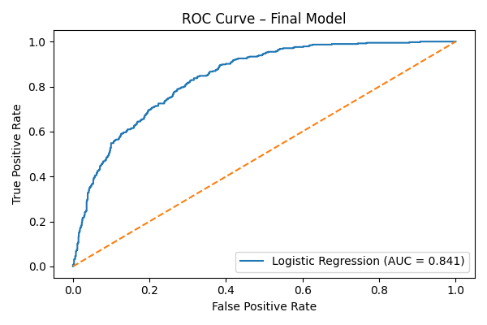

# Telco Customer Churn Prediction System

A machine learning system for predicting customer churn in a telecommunications company using supervised classification models.

---

## Model Performance Visualization

The ROC curve below illustrates the classification performance of the final Logistic Regression model, highlighting a strong balance between sensitivity and specificity across decision thresholds.

---

## Methodology
1. Data understanding and quality checks  
2. Data cleaning and feature engineering  
3. Exploratory Data Analysis (EDA)  
4. Baseline Logistic Regression  
5. Model comparison:
   - Logistic Regression  
   - Decision Tree  
   - Random Forest  
6. Hyperparameter tuning using GridSearchCV  
7. Final model selection and persistence  
8. Business interpretation of results  

---

## Model Performance
Models were evaluated using **ROC-AUC**, with Logistic Regression selected as the final model.

| Model               | ROC-AUC |
|--------------------|---------|
| Logistic Regression | **0.846** |
| Random Forest       | 0.845 |
| Decision Tree       | 0.818 |

**Final Model Selected:** Logistic Regression  
Chosen for its strong performance, stability, and interpretability.

---

## Key Insights
- Customers on **month-to-month contracts** are significantly more likely to churn  
- **Electronic check payments** and **paperless billing** correlate with higher churn  
- **Fiber optic customers** show elevated churn risk  
- Longer tenure and long-term contracts greatly reduce churn probability  
- Demographic variables (e.g. gender) have minimal impact  

---

## Business Recommendations
- Incentivize long-term contracts for new customers  
- Target early-tenure customers with retention campaigns  
- Review pricing and service expectations for fiber optic plans  
- Encourage automated and stable payment methods  

---

## Limitations
- Linear model assumptions may oversimplify complex customer behavior  
- No temporal modeling of churn over time  
- Dataset lacks customer satisfaction and customer support interaction data  

---

## Next Steps
- Deploy the model as an API  
- Add monitoring for prediction drift  
- Experiment with gradient boosting models  
- Incorporate customer interaction and support data  

---

## Tools & Technologies
- Python  
- pandas, numpy  
- scikit-learn  
- matplotlib, seaborn  
- joblib  
- Git & GitHub  

---

## Author
**Wamutira Munene**  
Data Analyst | Machine Learning

